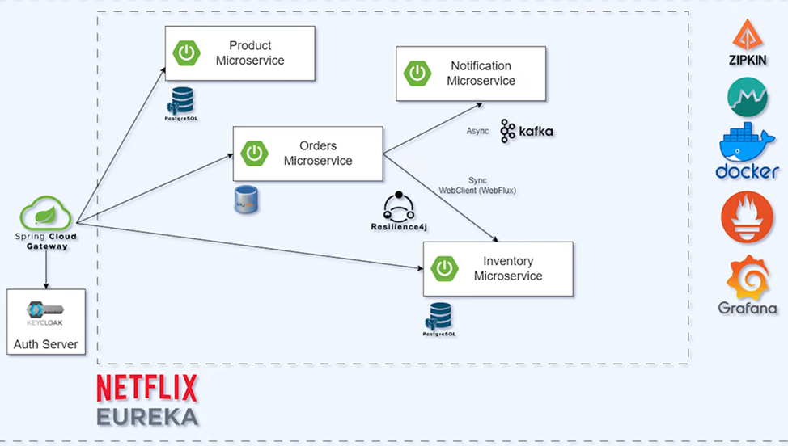
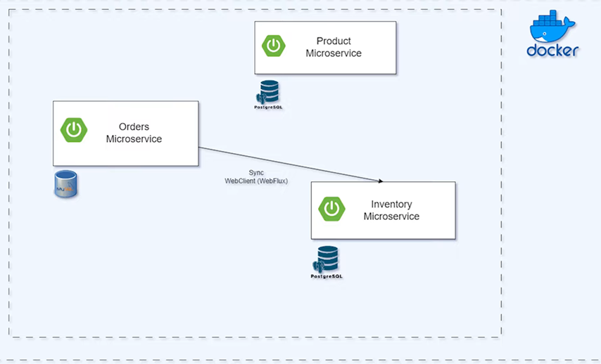
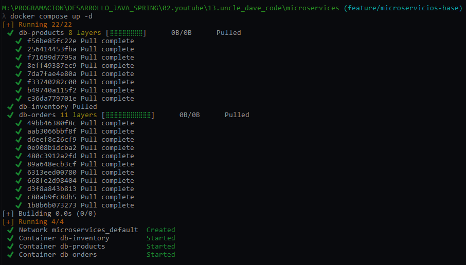
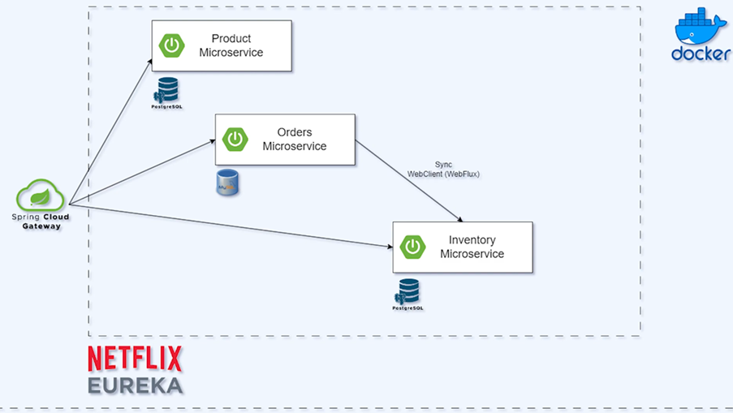

# [Creando una Aplicación Escalable - Microservicios con Spring Boot](https://www.youtube.com/playlist?list=PLlYjHWCxjWmAt5hE3OEaemlWkZBZa7w4e)

Tomado del canal de youtube **Uncle Dave's Code**

## Panorama general de la arquitectura a construir



## Microservicios Base



## Docker Compose: Creando Bases de Datos en contenedores Docker

Como vamos a hacer uso de varias bases de datos, optaremos por usar contenedores docker, de esa forma evitaremos usar
la base de datos de nuestra pc local y usar las bases de datos que estarán en los contenedores.

Empezaremos creando el archivo `compose.yml` en la raíz del proyecto y agregando los siguientes servicios de compose:

````yaml
services:
  ### PostgreSQL database for inventory
  db-inventory:
    container_name: db-inventory
    image: postgres:15.2-alpine
    restart: unless-stopped
    environment:
      POSTGRES_DB: db_inventory_service
      POSTGRES_USER: magadiflo
      POSTGRES_PASSWORD: magadiflo
    ports:
      - 5433:5432
    expose:
      - 5433
  ### MySQL database for orders
  db-orders:
    container_name: db-orders
    image: mysql:8.0.33
    restart: unless-stopped
    environment:
      MYSQL_DATABASE: db_orders_service
      MYSQL_USER: magadiflo
      MYSQL_PASSWORD: magadiflo
      MYSQL_ROOT_PASSWORD: magadiflo
    ports:
      - 3307:3306
    expose:
      - 3307
  ### PostgreSQL database for products
  db-products:
    container_name: db-products
    image: postgres:15.2-alpine
    restart: unless-stopped
    environment:
      POSTGRES_DB: db_products_service
      POSTGRES_USER: magadiflo
      POSTGRES_PASSWORD: magadiflo
    ports:
      - 5434:5432
    expose:
      - 5434
````

Ejecutamos nuestro archivo `compose.yml` con el siguiente comando para levantar todos los servicios definidos y en
modo `dettached (-d)`:

````bash
$ docker compose up -d
````



Verificamos los contenedores que han sido creados:

````bash
$ docker container ls -a
CONTAINER ID   IMAGE                  COMMAND                  CREATED         STATUS         PORTS                                         NAMES
81a4e40e8c5b   mysql:8.0.33           "docker-entrypoint.s…"   4 minutes ago   Up 3 minutes   3307/tcp, 33060/tcp, 0.0.0.0:3307->3306/tcp   db-orders
443366d4c477   postgres:15.2-alpine   "docker-entrypoint.s…"   4 minutes ago   Up 3 minutes   5434/tcp, 0.0.0.0:5434->5432/tcp              db-products
f63bcaa04b2f   postgres:15.2-alpine   "docker-entrypoint.s…"   4 minutes ago   Up 3 minutes   5433/tcp, 0.0.0.0:5433->5432/tcp              db-inventory
````

¡Listo!, hasta este punto ya podemos conectarnos a las bases de datos de los contenedores usando alguna herramienta
como `DBeaver`.

---

# Eureka Netflix y Spring Cloud Gateway

---

En esta sección del curso abordaremos dos componentes más de la arquitectura de microservicios: `Eureka Netflix` y
`Spring Cloud Gateway`:

