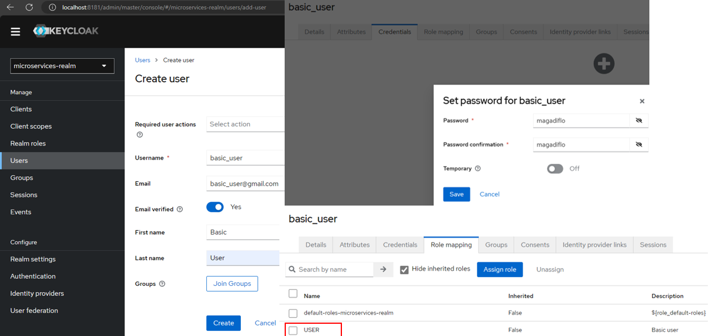

# [Creando una Aplicación Escalable - Microservicios con Spring Boot](https://www.youtube.com/playlist?list=PLlYjHWCxjWmAt5hE3OEaemlWkZBZa7w4e)

Tomado del canal de youtube **Uncle Dave's Code**

## Panorama general de la arquitectura a construir


## Microservicios Base


## Docker Compose: Creando Bases de Datos en contenedores Docker

Como vamos a hacer uso de varias bases de datos, optaremos por usar contenedores docker, de esa forma evitaremos usar
la base de datos de nuestra pc local y usar las bases de datos que estarán en los contenedores.

Empezaremos creando el archivo `compose.yml` en la raíz del proyecto y agregando los siguientes servicios de compose:

````yaml
services:
  ### PostgreSQL database for inventory
  db-inventory:
    container_name: db-inventory
    image: postgres:15.2-alpine
    restart: unless-stopped
    environment:
      POSTGRES_DB: db_inventory_service
      POSTGRES_USER: magadiflo
      POSTGRES_PASSWORD: magadiflo
    ports:
      - 5433:5432
    expose:
      - 5433
  ### MySQL database for orders
  db-orders:
    container_name: db-orders
    image: mysql:8.0.33
    restart: unless-stopped
    environment:
      MYSQL_DATABASE: db_orders_service
      MYSQL_USER: magadiflo
      MYSQL_PASSWORD: magadiflo
      MYSQL_ROOT_PASSWORD: magadiflo
    ports:
      - 3307:3306
    expose:
      - 3307
  ### PostgreSQL database for products
  db-products:
    container_name: db-products
    image: postgres:15.2-alpine
    restart: unless-stopped
    environment:
      POSTGRES_DB: db_products_service
      POSTGRES_USER: magadiflo
      POSTGRES_PASSWORD: magadiflo
    ports:
      - 5434:5432
    expose:
      - 5434
````

Ejecutamos nuestro archivo `compose.yml` con el siguiente comando para levantar todos los servicios definidos y en
modo `dettached (-d)`:

````bash
$ docker compose up -d
````


Verificamos los contenedores que han sido creados:

````bash
$ docker container ls -a
CONTAINER ID   IMAGE                  COMMAND                  CREATED         STATUS         PORTS                                         NAMES
81a4e40e8c5b   mysql:8.0.33           "docker-entrypoint.s…"   4 minutes ago   Up 3 minutes   3307/tcp, 33060/tcp, 0.0.0.0:3307->3306/tcp   db-orders
443366d4c477   postgres:15.2-alpine   "docker-entrypoint.s…"   4 minutes ago   Up 3 minutes   5434/tcp, 0.0.0.0:5434->5432/tcp              db-products
f63bcaa04b2f   postgres:15.2-alpine   "docker-entrypoint.s…"   4 minutes ago   Up 3 minutes   5433/tcp, 0.0.0.0:5433->5432/tcp              db-inventory
````

¡Listo!, hasta este punto ya podemos conectarnos a las bases de datos de los contenedores usando alguna herramienta
como `DBeaver`.

---

# Eureka Netflix y Spring Cloud Gateway

---

En esta sección del curso abordaremos dos componentes más de la arquitectura de microservicios: `Eureka Netflix` y
`Spring Cloud Gateway`:


---

# Spring Security, Keycloak y Resilience4j

En esta sección abordaremos tres temas importantes, entre las cuales está el uso de `keycloak` dentro de nuestra
arquitectura de microservicios.

`Keycloack` es una plataforma de gestión de identidad y acceso de código abierto para agregar características avanzadas
de seguridad como la gestión de usuarios y el flujo de `OAuth 2`.


## [Levantando contenedor Keycloak](https://www.keycloak.org/getting-started/getting-started-docker)

Crearemos dos nuevos servicios en nuestro archivo `compose.yml` uno para Keycloack y otro para la base de datos Postgres
que usará dicha plataforma:

````yaml
services:
  # Other services

  ### PostgreSQL database for Keycloak
  db-keycloak:
    container_name: db-keycloak
    image: postgres:15.2-alpine
    restart: unless-stopped
    environment:
      POSTGRES_DB: db_keycloak
      POSTGRES_USER: magadiflo
      POSTGRES_PASSWORD: magadiflo
    ports:
      - 5435:5432
    expose:
      - 5435
  ### Keycloak
  keycloak:
    container_name: keycloak
    image: quay.io/keycloak/keycloak:21.0.2
    restart: unless-stopped
    command: [ "start-dev" ]
    ports:
      - 8181:8080
    expose:
      - 8181
    depends_on:
      - db-keycloak
    environment:
      DB_VENDOR: POSTGRES
      DB_ADDR: db-keycloak
      DB_DATABASE: db_keycloak
      DB_PORT: 5435
      DB_USER: magadiflo
      DB_PASSWORD: magadiflo
      KEYCLOAK_ADMIN: admin
      KEYCLOAK_ADMIN_PASSWORD: admin
      KC_HTTP_PORT: 8080
````

Levantamos todos los contenedores con `docker compose`:

````bash
$ docker compose up -d
[+] Building 0.0s (0/0)
[+] Running 5/5
✔ Container db-keycloak   Started
✔ Container db-products   Started
✔ Container db-inventory  Started
✔ Container db-orders     Started
✔ Container keycloak      Started

$ docker container ls -a
CONTAINER ID   IMAGE                              COMMAND                  CREATED          STATUS              PORTS                                         NAMES
3916c67848b6   quay.io/keycloak/keycloak:21.0.2   "/opt/keycloak/bin/k…"   15 minutes ago   Up About a minute   8181/tcp, 8443/tcp, 0.0.0.0:8181->8080/tcp    keycloak
cad2c035fb75   postgres:15.2-alpine               "docker-entrypoint.s…"   18 minutes ago   Up About a minute   5435/tcp, 0.0.0.0:5435->5432/tcp              db-keycloak
4cde30018af0   postgres:15.2-alpine               "docker-entrypoint.s…"   4 days ago       Up About a minute   5434/tcp, 0.0.0.0:5434->5432/tcp              db-products
180c531d27e9   postgres:15.2-alpine               "docker-entrypoint.s…"   4 days ago       Up About a minute   5433/tcp, 0.0.0.0:5433->5432/tcp              db-inventory
d6714776dc2e   mysql:8.0.33                       "docker-entrypoint.s…"   4 days ago       Up About a minute   3307/tcp, 33060/tcp, 0.0.0.0:3307->3306/tcp   db-orders
````

Accedemos a `keycloack` a través del navegador web `http://localhost:8181/` y nos logeuamos con las credenciales de
`Keycloak`:


## Configurando Keycloak

Dentro del dashboard de `keycloak` empezaremos creando un `realm`. En keycloak un real es una especie de contenedor
lógico para agrupar usuarios, aplicaciones y configuraciones relacionadas con la seguridad permitiendo una gestión y
separación efectiva de los diferentes componentes del sistema de autenticación y autorización. Un `dominio (realm)`
gestiona un conjunto de usuarios, credenciales, roles y grupos. Un usuario pertenece a un `dominio` y se registra en él.
Los `dominios` están aislados entre sí y solo pueden gestionar y autenticar a los usuarios que controlan.


Ahora definiremos usuarios, roles y configuraremos una aplicación cliente:

### Roles


### Usuario Admin y Basic




### Aplicación Cliente


