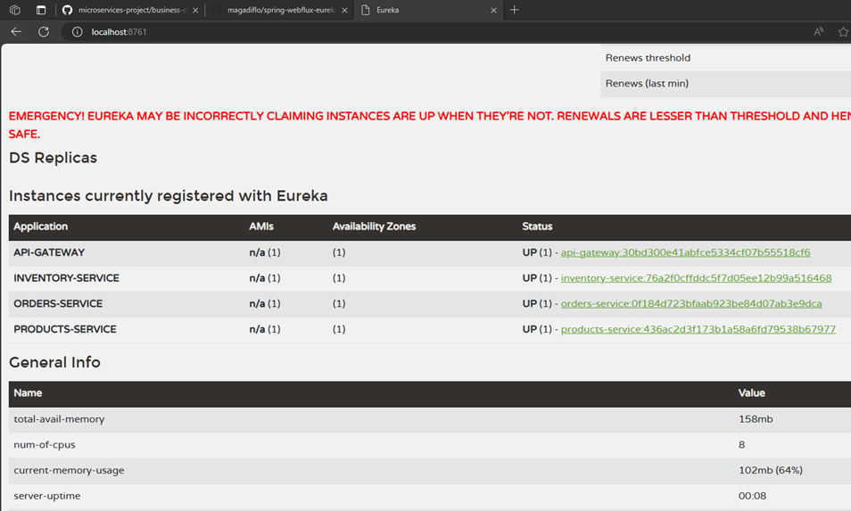

# Spring Cloud Gateway

## Configurando Rutas

En el `application.yml` configuramos las rutas de nuestros microservicios a las que desde nuestro `api-gateway` serán
redireccionadas las peticiones que se hagan:

````yml
server:
  port: 8080

spring:
  application:
    name: api-gateway

  cloud:
    gateway:
      routes:
        # Inventory service routes
        - id: inventory-service-route
          uri: http://localhost:8083
          predicates:
            - Path=/api/v1/inventories/**

        # Order service routes
        - id: orders-service-route
          uri: http://localhost:8082
          predicates:
            - Path=/api/v1/orders/**

        # Product service routes
        - id: products-service-route
          uri: http://localhost:8081
          predicates:
            - Path=/api/v1/products/**
````

A continuación explico el significado de las rutas. Tomaré como ejemplo la primera ruta:

- `id: inventory-service-route`, le asignamos un identificador único a la ruta.
- `uri: http://localhost:8083`, definimos la uri a la cual se enrutarán las solicitudes. En este caso, estamos colocando
  la uri del microservicio `inventory-service`, porque es el microservicio al que queremos enrutar en esta primera
  configuración de rutas.
- `Path=/api/v1/inventories/**`, el`Path` es un tipo de predicado que verifica si la ruta de la solicitud coincide con
  el patrón proporcionado. `/api/v1/inventories/**`, sería nuestro patrón de ruta. El doble asterisco `**` es un comodín
  que coincide con cualquier ruta adicional después de patrón proporcionado.

**FUNCIONAMIENTO**

> Supongamos que se hace una petición a nuestro `api-gateway` cuyo puerto es el `8080` a través de la siguiente
> dirección `http://localhost:8080/api/v1/inventories`, vemos que el `/api/v1/inventories` de esa solicitud coincide con
> la primera ruta definida en el `application.yml`, por lo tanto, redireccionará el `request` al `uri` de esa primera
> ruta, es decir al `uri: http://localhost:8083` concatenándole el patrón `/api/v1/inventories`. Entonces, finalmente la
> solicitud que saldrá desde el `api-gateway` al microservicio `inventory-service` será enviada a través de la siguiente
> dirección `http://localhost:8083/api/v1/inventories`.

---
**NOTA**

En los cursos de Andrés Guzmán, cuando trabajámos con `Spring Cloud Gateway` definíamos en las rutas el `filtro`
`StripPrefix=1` o `StripPrefix=2` dependiendo de cómo hayamos definido el predicate `Path`.

Tomemos como ejemplo la configuración que hicimos en el proyecto `microservices-project` para el `spring cloud gateway`:

````yml
spring:
  cloud:
    gateway:
      routes:
        - id: ms-productos
          uri: lb://ms-productos
          predicates:
            - Path=/api-base/productos-base/**
          filters:
            - StripPrefix=2
````

Como vemos, en el predicate `Path` definimos un patrón base `/api-base/productos-base/**`, pero además definimos el
filtro `StripPrefix` con valor `2`. Con este filtro estamos indicando el número de partes de la ruta que debemos
eliminar de la petición antes de enviarla al flujo descendente.

Veamos un ejemplo para entender qué es lo que hace el `StripPrefix=2` teniendo en cuenta que el controlador del
microservicio productos tiene esta configuración `@RequestMapping(path = "/api/v1/productos")`. Ahora, supongamos que
hacemos una petición a ese gateway:

```bash
$ http://127.0.0.1:8090/api-base/productos-base/api/v1/productos
``` 

Observamos que la dirección anterior coincide con el partón del path `/api-base/productos-base/**`, por lo tanto,
el `Gateway` redireccionará la solicitud a la uri del microservicio de productos. Pero antes de continuar, como está
definido el filtro `StripPrefix=2`, lo que hace el `Gateway` es eliminar las dos primeras partes del path, es decir,
eliminará el `/api-base/productos-base/` y concatenará a la uri destino el path restante. Finalmente, la url completa
quedaría así `lb://ms-productos/api/v1/productos`.

**¿Qué pasa si no colocamos el filtro StripPrefix?**, pues no eliminará ningún path, hará la llamada con toda la url
completa `lb://ms-productos/api-base/productos-base/api/v1/productos` y eso daría un error, ya que el microservicio
de productos tiene definido el path `/api/v1/productos`.

Ahora, volviendo a nuestro proyecto original, por ejemplo en el de la ruta cuyo id es `inventory-service-route`
**¿Por qué ahí no definimos un filtro StripPrefix?** Eso es porque como predicado `Path` estamos definiendo la misma
ruta que le definimos al microservicio `inventory-service`.

---

## Realizando pruebas a los microservicios a partir del Gateway

Levantamos todos nuestros microservicios: ApiGateway, Inventory, Products y Orders y realizamos las peticiones a todos
ellos pero usando como dirección la del `api-gateway` cuyo puerto es el `8080`:

- **product-service**, creamos un producto:

````bash
$  curl -v -X POST -H "Content-Type: application/json" -d "{\"sku\": \"000006\", \"name\": \"Laptop Toshiba\", \"description\": \"Laptop Toshiba\", \"price\": 100, \"status\": true}" http://localhost:8080/api/v1/products

>
< HTTP/1.1 201 Created
< Content-Length: 0
< Date: Sun, 10 Dec 2023 05:23:53 GMT
<
````

- **product-service**, listamos todos los productos:

````bash
$ curl -v http://localhost:8080/api/v1/products | jq

>
< HTTP/1.1 200 OK
< transfer-encoding: chunked
< Content-Type: application/json
<
[
  {
    "id": 1,
    "sku": "000001",
    "name": "Pc gamer",
    "description": "Pc gamer de ultimaa generacion",
    "price": 1800,
    "status": true
  },
  {...},
  {
    "id": 5,
    "sku": "000005",
    "name": "Florecente",
    "description": "Florecente Antiguo",
    "price": 70,
    "status": true
  }
]
````

- **orders-service**, creamos una nueva orden:

````bash
$ curl -v -X POST -H "Content-Type: application/json" -d "{\"items\": [{\"sku\": \"000001\", \"price\": 500, \"quantity\": 2}, {\"sku\": \"000002\", \"price\": 15, \"quantity\": 10}]}" http://localhost:8080/api/v1/orders

>
< HTTP/1.1 201 Created
< Content-Type: text/plain;charset=UTF-8
<
Order placed successfully
````

- **orders-service**, listamos las órdenes creadas:

````bash
$ curl -v http://localhost:8080/api/v1/orders | jq

>
< HTTP/1.1 200 OK
< transfer-encoding: chunked
< Content-Type: application/json
<
[
  {
    "id": 2,
    "orderNumber": "1e3b15e9-c3e5-4438-a454-5462268f4a6c",
    "items": [
      {
        "id": 2,
        "sku": "000001",
        "price": 500,
        "quantity": 2
      }
    ]
  },
  {...},
  {
    "id": 8,
    "orderNumber": "9b191b1a-5533-4fdc-9daf-1d39b8849ed7",
    "items": [
      {
        "id": 9,
        "sku": "000001",
        "price": 500,
        "quantity": 2
      },
      {
        "id": 10,
        "sku": "000002",
        "price": 15,
        "quantity": 10
      }
    ]
  }
]
````

- **inventory-service**, verificamos si existe stock para el producto `000001`:

````bash
$ curl -v http://localhost:8080/api/v1/inventories/000001 | jq

>
< HTTP/1.1 200 OK
< transfer-encoding: chunked
< Content-Type: application/json
<
true
````

**CONCLUSIÓN**
> Desde ahora ya podemos hacer uso del `API-GATEWAY` para hacer peticiones a nuestros microservicios. Será el
> `API-GATEWAY` quien redireccionará las peticiones al microservicio correspondiente.

---

## Registrando microservicio como Cliente de Eureka

En este apartado veremos cómo registrar este microservicio de `api-gateway` como un cliente del servidor de eureka. La
misma configuración será para los microservicios: `inventory-service, orders-service y products-service`.

Lo primero que debemos hacer es agregar en el `pom.xml` de cada microservicio que queremos hacer cliente de eureka, la
siguiente dependencia:

````xml

<dependency>
    <groupId>org.springframework.cloud</groupId>
    <artifactId>spring-cloud-starter-netflix-eureka-client</artifactId>
</dependency>
````

**NOTA**
> Al tener `spring-cloud-starter-netflix-eureka-client` en el classpath, su aplicación se registra automáticamente con
> el servidor Eureka, eso significa que no necesitamos agregar alguna anotación adicional para habilitar al
> microservicio como cliente de eureka, tan solo basta tener la dependencia anterior en el `pom.xml`.

Ahora, necesitamos agregar algunas configuraciones en el  `application.yml`:

````yml
eureka:
  client:
    service-url:
      defaultZone: http://localhost:8761/eureka/    # (1)
  instance:
    instance-id: ${spring.application.name}:${spring.application.instance_id:${random.value}}   # (2)
````

**DONDE**

- `(1)`, definimos la dirección eureka server. Aquí es donde nuestro cliente de eureka debe registrarse.
- `(2)`, [(ver Changing the Eureka Instance ID)](https://cloud.spring.io/spring-cloud-netflix/multi/multi__service_discovery_eureka_clients.html),
  antes de explicar el significado del valor de esa `instance-id`, debemos entender que, por
  defecto `solo hay un servicio por host`, es decir, por defecto una instancia de vanilla Netflix Eureka se registra con
  un ID que es igual a su nombre de host. Ahora, puede darse el caso de que existan múltiples instancias de un mismo
  microservicio, así que para que el valor del `instance-id` no se repita, podemos anular el valor proporcionado por
  un identificador único para cada instancia. Eso lo logramos con esa expresión que colocamos en el `instance-id`. Con
  los metadatos mostrados en el valor del `instance-id` y múltiples instancias de servicio desplegadas en localhost, el
  valor aleatorio se inserta allí para hacer que la instancia sea única.

**NOTA**

> Es importante tener definido el nombre de la aplicación en los microservicios utilizando la configuración
> `spring.application.name`

## Ejecutando Eureka Server + Eureka Clients

Una vez que hemos configurado todos los microservicios que son clientes de eureka, como `api-gateway, inventory-service,
orders-service y products-service` llega el momento de levantarlos. Iniciamos levantando `Eureka Server` y luego
todos los demás microservicios.

En la interfaz web de `Eureka Server` vemos las instancias de todos los microservicios registrados:



## Modificando routes para usar Load Balancer

Ahora que estamos usando `Eureka Server` y hemos configurado las aplicaciones clientes con `Eureka Client` debemos
modificar la configuración del `application.yml`. Actualmente, las rutas las estamos definiendo en código duro, es
decir, por ejemplo para la primera ruta está definida de esta manera: `uri: http://localhost:8083`, debemos modificarlo
para que ahora se pueda utilizar el `load balancer`. Esto significa que, podemos tener un microservicio con múltiples
instancias, por lo que utilizar `load balancer` entre esas múltiples instancias del servicio registrado en el eureka
server, ayudará a lograr un enrutamiento dinámico y equilibrado de la carga.

Entonces, para lograr el `load balancer` debemos modificar la uri de las routes, tal como se muestra a continuación:

````yml
spring:
  cloud:
    gateway:
      routes:
        # Inventory service routes
        - id: inventory-service-route
          uri: lb://inventory-service #<--- Antes: http://localhost:8083
          predicates:
            - Path=/api/v1/inventories/**

        # Order service routes
        - id: orders-service-route
          uri: lb://orders-service    #<--- Antes: http://localhost:8082
          predicates:
            - Path=/api/v1/orders/**

        # Product service routes
        - id: products-service-route
          uri: lb://products-service  #<--- Antes: http://localhost:8081
          predicates:
            - Path=/api/v1/products/**
````

**DONDE**

- `uri: lb://inventory-service`, el `lb` indica que se aplicará `load balancer` y el `inventory-service` es el nombre
  del microservicio al que apunta. Ese nombre está definido en la configuración `spring.application.name` de dicho
  microservicio (lo mismo para las otras rutas).