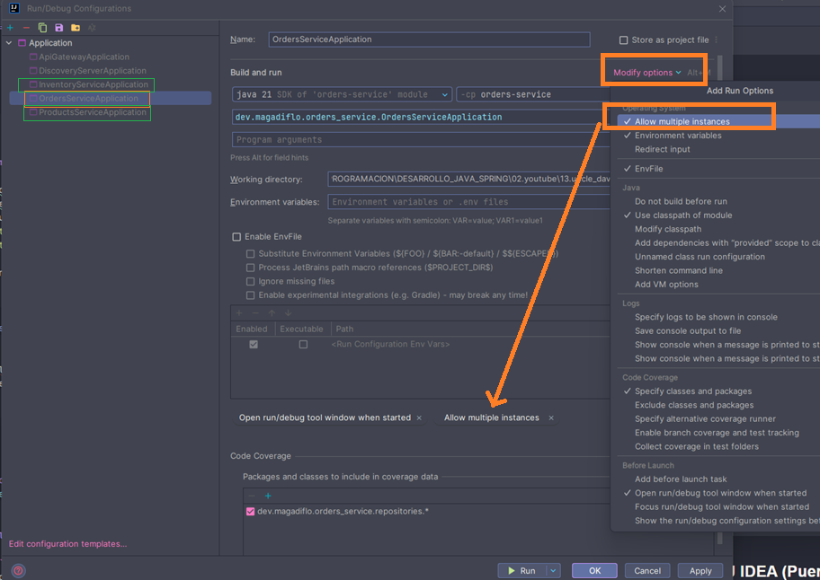
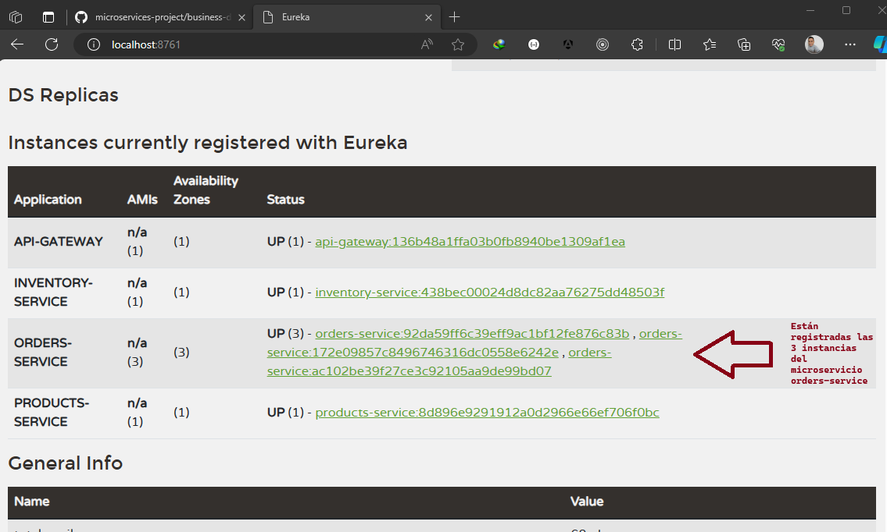

# Spring Cloud Gateway

## Configurando Rutas

En el `application.yml` configuramos las rutas de nuestros microservicios a las que desde nuestro `api-gateway` serán
redireccionadas las peticiones que se hagan:

````yml
server:
  port: 8080

spring:
  application:
    name: api-gateway

  cloud:
    gateway:
      routes:
        # Inventory service routes
        - id: inventory-service-route
          uri: http://localhost:8083
          predicates:
            - Path=/api/v1/inventories/**

        # Order service routes
        - id: orders-service-route
          uri: http://localhost:8082
          predicates:
            - Path=/api/v1/orders/**

        # Product service routes
        - id: products-service-route
          uri: http://localhost:8081
          predicates:
            - Path=/api/v1/products/**
````

A continuación explico el significado de las rutas. Tomaré como ejemplo la primera ruta:

- `id: inventory-service-route`, le asignamos un identificador único a la ruta.
- `uri: http://localhost:8083`, definimos la uri a la cual se enrutarán las solicitudes. En este caso, estamos colocando
  la uri del microservicio `inventory-service`, porque es el microservicio al que queremos enrutar en esta primera
  configuración de rutas.
- `Path=/api/v1/inventories/**`, el`Path` es un tipo de predicado que verifica si la ruta de la solicitud coincide con
  el patrón proporcionado. `/api/v1/inventories/**`, sería nuestro patrón de ruta. El doble asterisco `**` es un comodín
  que coincide con cualquier ruta adicional después de patrón proporcionado.

**FUNCIONAMIENTO**

> Supongamos que se hace una petición a nuestro `api-gateway` cuyo puerto es el `8080` a través de la siguiente
> dirección `http://localhost:8080/api/v1/inventories`, vemos que el `/api/v1/inventories` de esa solicitud coincide con
> la primera ruta definida en el `application.yml`, por lo tanto, redireccionará el `request` al `uri` de esa primera
> ruta, es decir al `uri: http://localhost:8083` concatenándole el patrón `/api/v1/inventories`. Entonces, finalmente la
> solicitud que saldrá desde el `api-gateway` al microservicio `inventory-service` será enviada a través de la siguiente
> dirección `http://localhost:8083/api/v1/inventories`.

---
**NOTA**

En los cursos de Andrés Guzmán, cuando trabajámos con `Spring Cloud Gateway` definíamos en las rutas el `filtro`
`StripPrefix=1` o `StripPrefix=2` dependiendo de cómo hayamos definido el predicate `Path`.

Tomemos como ejemplo la configuración que hicimos en el proyecto `microservices-project` para el `spring cloud gateway`:

````yml
spring:
  cloud:
    gateway:
      routes:
        - id: ms-productos
          uri: lb://ms-productos
          predicates:
            - Path=/api-base/productos-base/**
          filters:
            - StripPrefix=2
````

Como vemos, en el predicate `Path` definimos un patrón base `/api-base/productos-base/**`, pero además definimos el
filtro `StripPrefix` con valor `2`. Con este filtro estamos indicando el número de partes de la ruta que debemos
eliminar de la petición antes de enviarla al flujo descendente.

Veamos un ejemplo para entender qué es lo que hace el `StripPrefix=2` teniendo en cuenta que el controlador del
microservicio productos tiene esta configuración `@RequestMapping(path = "/api/v1/productos")`. Ahora, supongamos que
hacemos una petición a ese gateway:

```bash
$ http://127.0.0.1:8090/api-base/productos-base/api/v1/productos
``` 

Observamos que la dirección anterior coincide con el partón del path `/api-base/productos-base/**`, por lo tanto,
el `Gateway` redireccionará la solicitud a la uri del microservicio de productos. Pero antes de continuar, como está
definido el filtro `StripPrefix=2`, lo que hace el `Gateway` es eliminar las dos primeras partes del path, es decir,
eliminará el `/api-base/productos-base/` y concatenará a la uri destino el path restante. Finalmente, la url completa
quedaría así `lb://ms-productos/api/v1/productos`.

**¿Qué pasa si no colocamos el filtro StripPrefix?**, pues no eliminará ningún path, hará la llamada con toda la url
completa `lb://ms-productos/api-base/productos-base/api/v1/productos` y eso daría un error, ya que el microservicio
de productos tiene definido el path `/api/v1/productos`.

Ahora, volviendo a nuestro proyecto original, por ejemplo en el de la ruta cuyo id es `inventory-service-route`
**¿Por qué ahí no definimos un filtro StripPrefix?** Eso es porque como predicado `Path` estamos definiendo la misma
ruta que le definimos al microservicio `inventory-service`.

---

## Realizando pruebas a los microservicios a partir del Gateway

Levantamos todos nuestros microservicios: ApiGateway, Inventory, Products y Orders y realizamos las peticiones a todos
ellos pero usando como dirección la del `api-gateway` cuyo puerto es el `8080`:

- **product-service**, creamos un producto:

````bash
$  curl -v -X POST -H "Content-Type: application/json" -d "{\"sku\": \"000006\", \"name\": \"Laptop Toshiba\", \"description\": \"Laptop Toshiba\", \"price\": 100, \"status\": true}" http://localhost:8080/api/v1/products

>
< HTTP/1.1 201 Created
< Content-Length: 0
< Date: Sun, 10 Dec 2023 05:23:53 GMT
<
````

- **product-service**, listamos todos los productos:

````bash
$ curl -v http://localhost:8080/api/v1/products | jq

>
< HTTP/1.1 200 OK
< transfer-encoding: chunked
< Content-Type: application/json
<
[
  {
    "id": 1,
    "sku": "000001",
    "name": "Pc gamer",
    "description": "Pc gamer de ultimaa generacion",
    "price": 1800,
    "status": true
  },
  {...},
  {
    "id": 5,
    "sku": "000005",
    "name": "Florecente",
    "description": "Florecente Antiguo",
    "price": 70,
    "status": true
  }
]
````

- **orders-service**, creamos una nueva orden:

````bash
$ curl -v -X POST -H "Content-Type: application/json" -d "{\"items\": [{\"sku\": \"000001\", \"price\": 500, \"quantity\": 2}, {\"sku\": \"000002\", \"price\": 15, \"quantity\": 10}]}" http://localhost:8080/api/v1/orders

>
< HTTP/1.1 201 Created
< Content-Type: text/plain;charset=UTF-8
<
Order placed successfully
````

- **orders-service**, listamos las órdenes creadas:

````bash
$ curl -v http://localhost:8080/api/v1/orders | jq

>
< HTTP/1.1 200 OK
< transfer-encoding: chunked
< Content-Type: application/json
<
[
  {
    "id": 2,
    "orderNumber": "1e3b15e9-c3e5-4438-a454-5462268f4a6c",
    "items": [
      {
        "id": 2,
        "sku": "000001",
        "price": 500,
        "quantity": 2
      }
    ]
  },
  {...},
  {
    "id": 8,
    "orderNumber": "9b191b1a-5533-4fdc-9daf-1d39b8849ed7",
    "items": [
      {
        "id": 9,
        "sku": "000001",
        "price": 500,
        "quantity": 2
      },
      {
        "id": 10,
        "sku": "000002",
        "price": 15,
        "quantity": 10
      }
    ]
  }
]
````

- **inventory-service**, verificamos si existe stock para el producto `000001`:

````bash
$ curl -v http://localhost:8080/api/v1/inventories/000001 | jq

>
< HTTP/1.1 200 OK
< transfer-encoding: chunked
< Content-Type: application/json
<
true
````

**CONCLUSIÓN**
> Desde ahora ya podemos hacer uso del `API-GATEWAY` para hacer peticiones a nuestros microservicios. Será el
> `API-GATEWAY` quien redireccionará las peticiones al microservicio correspondiente.

---

## Registrando microservicio como Cliente de Eureka

En este apartado veremos cómo registrar este microservicio de `api-gateway` como un cliente del servidor de eureka. La
misma configuración será para los microservicios: `inventory-service, orders-service y products-service`.

Lo primero que debemos hacer es agregar en el `pom.xml` de cada microservicio que queremos hacer cliente de eureka, la
siguiente dependencia:

````xml

<dependency>
    <groupId>org.springframework.cloud</groupId>
    <artifactId>spring-cloud-starter-netflix-eureka-client</artifactId>
</dependency>
````

**NOTA**
> Al tener `spring-cloud-starter-netflix-eureka-client` en el classpath, su aplicación se registra automáticamente con
> el servidor Eureka, eso significa que no necesitamos agregar alguna anotación adicional para habilitar al
> microservicio como cliente de eureka, tan solo basta tener la dependencia anterior en el `pom.xml`.

Ahora, necesitamos agregar algunas configuraciones en el  `application.yml`:

````yml
eureka:
  instance:
    hostname: localhost   # (3)
    instance-id: ${spring.application.name}:${spring.application.instance_id:${random.value}}   # (1)
  client:
    service-url:
      defaultZone: http://localhost:8761/eureka/    # (2)
````

**DONDE**

- `(1)`, [(ver Changing the Eureka Instance ID)](https://cloud.spring.io/spring-cloud-netflix/multi/multi__service_discovery_eureka_clients.html),
  antes de explicar el significado del valor de esa `instance-id`, debemos entender que, por
  defecto `solo hay un servicio por host`, es decir, por defecto una instancia de vanilla Netflix Eureka se registra con
  un ID que es igual a su nombre de host. Ahora, puede darse el caso de que existan múltiples instancias de un mismo
  microservicio, así que para que el valor del `instance-id` no se repita, podemos anular el valor proporcionado por
  un identificador único para cada instancia. Eso lo logramos con esa expresión que colocamos en el `instance-id`. Con
  los metadatos mostrados en el valor del `instance-id` y múltiples instancias de servicio desplegadas en localhost, el
  valor aleatorio se inserta allí para hacer que la instancia sea única.
- `(2)`, definimos la dirección eureka server. Aquí es donde nuestro cliente de eureka debe registrarse.

**NOTA**

> Debemos definir el nombre de cada microservicio utilizando la configuración `spring.application.name`

**IMPORTANTE**

Sobre la configuración `# (3) hostname: localhost`, este atributo **lo colocamos en todos los microservicios clientes de
eureka** como solución al error que nos producía el microservicio `api-gateway`, ese error se muestra a continuación:

````bash
java.net.UnknownHostException: Failed to resolve 'DESKTOP-EGDL8Q6.mshome.net' [A(1), AAAA(28)]. Exceeded max queries per resolve 16 
	at io.netty.resolver.dns.DnsResolveContext.finishResolve(DnsResolveContext.java:1097) ~[netty-resolver-dns-4.1.101.Final.jar:4.1.101.Final]
	Suppressed: reactor.core.publisher.FluxOnAssembly$OnAssemblyException: 
Error has been observed at the following site(s):
	*__checkpoint ⇢ org.springframework.cloud.gateway.filter.WeightCalculatorWebFilter [DefaultWebFilterChain]
	*__checkpoint ⇢ HTTP GET "/api/v1/products" [ExceptionHandlingWebHandler]
````

El error `UnknownHostException` indica que no se pudo resolver el nombre de host `DESKTOP-EGDL8Q6.mshome.net`. Este
error se produce cuando el sistema no puede traducir el nombre de host proporcionado en una dirección IP. Por lo que
estuve investigando y logré encontrar dos soluciones:

- **1° solución**, agregar el `hostname: localhost`.
  Al agregar la propiedad `hostname: localhost` en la configuración del cliente Eureka, estás indicando explícitamente
  que el nombre de host que se debe utilizar para registrar el servicio en Eureka es "localhost". Esto evita problemas
  de resolución de nombres de host, ya que "localhost" es una referencia a la propia máquina y generalmente se resuelve
  correctamente.


- **2° solución**, agregar `eureka.instance.prefer-ip-address: true`. Al establecer `prefer-ip-address: true` en la
  configuración del cliente Eureka, estás indicando que prefieres utilizar la dirección IP en lugar del nombre de host
  al registrarse en el servidor Eureka. Esto puede resolver el problema porque elimina la dependencia de la resolución
  de nombres de host, evitando así el error `UnknownHostException` que experimentaste inicialmente.

## Ejecutando Eureka Server + Eureka Clients

Una vez que hemos configurado todos los microservicios que son clientes de eureka, como `api-gateway, inventory-service,
orders-service y products-service` llega el momento de levantarlos. Iniciamos levantando `Eureka Server` y luego
todos los demás microservicios.

En la interfaz web de `Eureka Server` vemos las instancias de todos los microservicios registrados:


## Modificando routes para usar Load Balancer

Ahora que estamos usando `Eureka Server` y hemos configurado las aplicaciones clientes con `Eureka Client` debemos
modificar la configuración del `application.yml`. Actualmente, las rutas las estamos definiendo en código duro, es
decir, por ejemplo para la primera ruta está definida de esta manera: `uri: http://localhost:8083`, debemos modificarlo
para que ahora se pueda utilizar el `load balancer`. Esto significa que, podemos tener un microservicio con múltiples
instancias, por lo que utilizar `load balancer` entre esas múltiples instancias del servicio registrado en el eureka
server, ayudará a lograr un enrutamiento dinámico y equilibrado de la carga.

Entonces, para lograr el `load balancer` debemos modificar la uri de las routes, tal como se muestra a continuación:

````yml
spring:
  cloud:
    gateway:
      routes:
        # Inventory service routes
        - id: inventory-service-route
          uri: lb://inventory-service #<--- Antes: http://localhost:8083
          predicates:
            - Path=/api/v1/inventories/**

        # Order service routes
        - id: orders-service-route
          uri: lb://orders-service    #<--- Antes: http://localhost:8082
          predicates:
            - Path=/api/v1/orders/**

        # Product service routes
        - id: products-service-route
          uri: lb://products-service  #<--- Antes: http://localhost:8081
          predicates:
            - Path=/api/v1/products/**
````

**DONDE**

- `uri: lb://inventory-service`, el `lb` indica que se aplicará `load balancer` y el `inventory-service` es el nombre
  del microservicio al que apunta. Ese nombre está definido en la configuración `spring.application.name` de dicho
  microservicio (lo mismo para las otras rutas).

## Verificando si los microservicios siguen funcionando con la configuración del lb (load balancer)

Luego de que modificamos las rutas del `api-gateway` para usar `Load Balancer` ejecutamos todos los microservicios
para verificar que siguen funcionando como antes. Ejecutar en el siguiente orden:

````
1. inventory-service (eureka)
2. microservicios del dominio (products, orders, inventories)
3. api-gateway
````

Ahora realizaremos peticiones a los distintos microservicios pero usando el `api-gateway`, es decir las peticiones irán
al servidor `api-gateway` a su puerto `8080` y este las redireccionará al microservicio correspondiente:

- Listando productos:

````bash
$ curl -v http://localhost:8080/api/v1/products | jq

>
< HTTP/1.1 200 OK
< transfer-encoding: chunked
< Content-Type: application/json
<
[
  {
    "id": 1,
    "sku": "000001",
    "name": "Pc gamer",
    "description": "Pc gamer de ultimaa generacion",
    "price": 1800,
    "status": true
  },
  {...},
  {
    "id": 5,
    "sku": "000005",
    "name": "Florecente",
    "description": "Florecente Antiguo",
    "price": 70,
    "status": true
  }
]
````

- Registrando una orden:

````bash
$ curl -v -X POST -H "Content-Type: application/json" -d "{\"items\": [{\"sku\": \"000002\", \"price\": 3.90, \"quantity\": 3}]}" http://localhost:8080/api/v1/orders

>
< HTTP/1.1 201 Created
< Content-Type: text/plain;charset=UTF-8
<
Order placed successfully
````

- Listando las órdenes:

````bash
$ curl -v http://localhost:8080/api/v1/orders | jq

>
< HTTP/1.1 200 OK
< transfer-encoding: chunked
< Content-Type: application/json
<
[
  {
    "id": 2,
    "orderNumber": "1e3b15e9-c3e5-4438-a454-5462268f4a6c",
    "items": [
      {
        "id": 2,
        "sku": "000001",
        "price": 500,
        "quantity": 2
      }
    ]
  },
  {...},
  {
    "id": 13,
    "orderNumber": "55614804-fa96-4058-9fe3-8f6fffb4a201",
    "items": [
      {
        "id": 15,
        "sku": "000002",
        "price": 3.9,
        "quantity": 3
      }
    ]
  }
]
````

- Verificando inventario de un producto:

````bash
$ curl -v http://localhost:8080/api/v1/inventories/000002 | jq

>
< HTTP/1.1 200 OK
< transfer-encoding: chunked
< Content-Type: application/json
<
true
````

## Configurando microservicios para crear múltiples instancias

Para crear múltiples instancias de un microservicio es necesario cambiar el puerto que definimos a cada microservicio
cliente de eureka con excepción del microservicio `api-gateway`, ya que tendremos una única instancia de ese
microservicio y además tendremos fijo su puerto `8080`. Con respecto a los otros microservicios clientes de eureka
`(products-service, orders-service e inventory-service)` sus puertos tendrán en `valor de 0 (cero)` para que cuando
levantemos las instancias, estas `se levanten en un puerto aleatorio.`

Entonces, las modificaciones que haremos en los microservicios mencionados será como se muestra a continuación:

````yaml
server:
  port: 0 # Cero (0) indica que el puerto será generado de manera aleatorio al levantar el microservicio
````

Finalmente, para ver cómo es que trabaja el `api-gateway` al seleccionar una instancia de las múltiples existentes
vamos a agregar la siguente configuración en `application.yml`:

````yml
# Log
logging:
  level:
    root: info
    org.springframework.cloud.gateway: trace
    org.springframework.cloud.gateway.route.RouteDefinitionRouteLocator: info
````

## Configurando IntelliJ IDEA para ejecutar múltiples instancias

Para ejecutar múltiples instancias usando `intelliJ IDEA`, debemos tener definido los puertos de los microservicios
que queremos generar múltiples instancias con valor 0 (ya lo hicimos en el apartado anterior). Luego, vamos a
`Edit Configurations...`, seleccionamos en la parte izquierda la configuración que queremos agregar múltiples
instancias, damos click en `Modify options` y seleccionamos `Allow multiple instances`. Esta configuración la hice en
los tres microservicios de dominio: **products-service, orders-service e inventory-service.** Veamos la imagen para
una mejor comprensión.



## Ejecutando múltiples instancias

Ejecutaremos todos los microservicios, pero para el tema de las múltiples instancias trabajaremos con el microservicio
`orders-service`, es decir, utilizando `IntelliJ IDEA` ejecutaremos dos instancias adicionales de dicho microservicio.
Veamos cómo tendríamos los microservicios registrados en eureka server:



Los puertos aleatorios asignados a cada instancia del microservicio orders-service son:

- 53322
- 53232
- 53343

Ahora, ejecutaremos **TRES VECES** la petición a través del `api-gateway` al microservicio `orders-service`:

````bash
$ curl -v -X POST -H "Content-Type: application/json" -d "{\"items\": [{\"sku\": \"000001\", \"price\": 1.50, \"quantity\": 8}]}" http://localhost:8080/api/v1/orders

>
< HTTP/1.1 201 Created
< Content-Type: text/plain;charset=UTF-8
<
Order placed successfully
````

Podemos observar que las peticiones se realizan correctamente. Ahora vayamos al log del microservicio `api-gateway` y
veamos qué instancias de las 3 generadas son usadas en cada petición:

````bash
[1] LoadBalancerClientFilter url chosen: http://localhost:53322/api/v1/orders
[2] LoadBalancerClientFilter url chosen: http://localhost:53343/api/v1/orders
[3] LoadBalancerClientFilter url chosen: http://localhost:53232/api/v1/orders
````

Como observamos se está ejecutando de manera equitativa una instancia distinta en cada petición, eso ocurre porque
`Spring Cloud Gateway` usa por defecto el algoritmo `Round Robin`.

De esta manera queda demostrado que nuestras configuraciones y sobre todo las múltiples instancias generadas están
funcionando correctamente.

