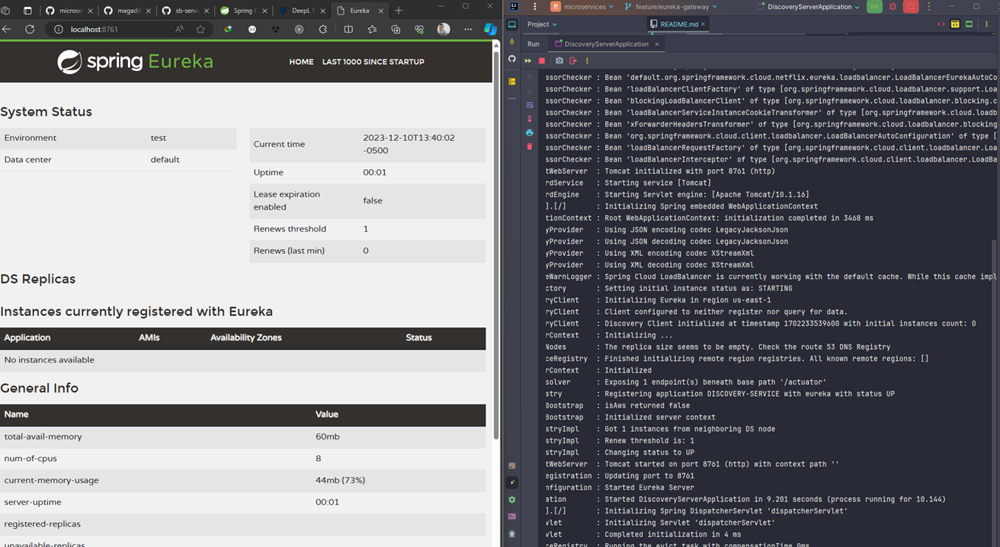

# Service Discovery: Eureka Server

## Dependencias

Para trabajar con `Eureka Server` debemos usar la siguiente dependencia:

````xml
<!--Spring Boot 3.2.0-->
<!--Spring Cloud 2023.0.0-->
<!--Java 21-->
<dependencies>
    <dependency>
        <groupId>org.springframework.cloud</groupId>
        <artifactId>spring-cloud-starter-netflix-eureka-server</artifactId>
    </dependency>
</dependencies>
````

**NOTA**

> En algunos proyectos que realicé del curso de Andrés Guzmán he estado mencionando que si usamos el JDK 11 [o superior]
> debemos incluir una dependencia
> [jaxb-runtime, como parte del soporte al JDK 11](https://docs.spring.io/spring-cloud-netflix/reference/spring-cloud-netflix.html#_jdk_11_support),
> bueno, en realidad he interpretado mal, ya que agregar la dependencia de `jaxb-runtime` es
> únicamente `sí usamos java 11`, pues la documentación
> menciona `Si tiene intención de utilizar JDK 11 al ejecutar un servidor Eureka, debe incluir estas dependencias...`,
> por lo tanto, en este proyecto, como estoy usando `java 21` únicamente necesitamos la dependencia de Eureka Server.

## Configurando Eureka Server

Lo primero que debemos hacer es **habilitar este microservicio como un servidor de eureka**, para eso usamos la
anotación `@EnableEurekaServer` en la clase principal:

````java

@EnableEurekaServer //<-- Habilitando el proyecto como servidor de eureka
@SpringBootApplication
public class DiscoveryServerApplication {
    public static void main(String[] args) {
        SpringApplication.run(DiscoveryServerApplication.class, args);
    }
}
````

Y lo segundo sería configurar el `application.yml`:

````yml
server:
  port: 8761

spring:
  application:
    name: discovery-service

eureka:
  instance:
    hostname: localhost           # (1)
    prefer-ip-address: false      # (2)

  client:
    register-with-eureka: false   # (3)
    fetch-registry: false         # (4)
    service-url:
      defaultZone: http://${eureka.instance.hostname}:${server.port}/eureka/  # (5)
````

**DONDE**

- `(1)`, hostname que tendrá esta instancia eureka.
- `(2)`, la propiedad `prefer-ip-address` por defecto es `false`, eso significa que cuando una aplicación se registre en
  eureka, utilizará su hostname. Mientras que si colocamos en `true`, cuando una aplicación se registre en eureka,
  utilizará su dirección IP.
- `(3)`, por defecto el servidor de eureka, a parte de ser un servidor, se registra a sí mismo como un cliente. Por lo
  tanto, para evitar que el servidor Eureka se registre a sí mismo como un cliente, debemos colocar la propiedad en
  `false`. El servidor Eureka no necesita descubrirse a sí mismo.
- `(4)`, controla si el servidor de eureka debe intentar recuperar (fetch) el registro de servicios de otros servidores
  Eureka en el entorno. En este caso, al colocar la propiedad en `false`, estamos configurando el servidor Eureka para
  que no intente recuperar (fetch) el registro de otros servidores Eureka. Esto significa que el servidor Eureka no
  intentará sincronizar la información de registro de servicios con otros servidores Eureka en la red. **Esta
  configuración puede tener sentido en ciertos escenarios. Por ejemplo, si estás ejecutando un único servidor Eureka y
  no tienes un clúster de servidores Eureka, o si estás utilizando un enfoque diferente para la sincronización del
  registro de servicios en tu entorno.**
- `(5)`, configura la url del servidor de Eureka al que un cliente eureka debe registrarse y buscar el registro de
  servicios.

## Ejecutando Servidor Eureka

Si ejecutamos el proyecto, podemos ver `eureka server` en funcionamiento a través del
navegador `http://localhost:8761/`:


